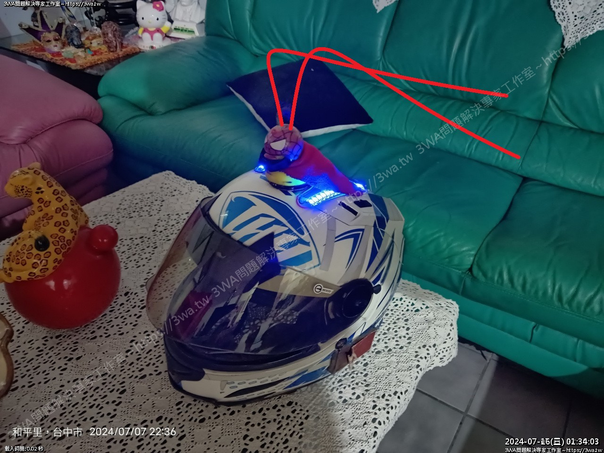

# helmet_rpm_led
(Arduino D1 mini) 這是一個引擎轉速在拉轉，安全帽上的燈條也在拉轉的故事...

假如我們可以抓到機車的引擎轉速，那就透過無線傳輸把轉速訊號傳到安全帽上顯示

<h3>作者：</h3>
	羽山秋人 (https://3wa.tw)

<h3>版權：</h3>
	MIT License
	
<h3>所需材料：</h3>
<ul>
	<li>1. Arduino D1 mini x 2</li>
	<li>2. RGB Pixel 燈條 5V，間距的話建議 144 ，比較密，長度就自己覺得多長看得爽~</li>
    <li>3. PC817</li>
	<li>4. 基納 (5.1V 1/2w)</li>
	<li>5. 電阻 470Ω 1/2w</li>
	<li>6. 電阻 1KΩ 1/2w</li>
	<li>7. 電阻 1.2KΩ 1/2w</li>
	<li>8. 如果要裝上車，還需要 BUCK DC-to-DC MP1584</li>
    <li>9. 鋰電池 14500 3.7V 800mAh</li>
	<li>10. AA 3號電池 電池盒 單排或雙排</li>
	<li>11. 恥力要很夠</li>
</ul>

假設那二條像嗄抓的尾巴是 LED 燈條，可以用來顯示車主瘋狂拉轉XD

 
使用二塊有 Wifi 的 Arduino D1 mini 作為開發板

<h3>Server端(裝在安全帽上):</h3>
	啟動後會變成 Wifi AP ，等待 Client 端的轉速訊號，只要一收到轉速訊號，就變換燈條的顯示燈數與顏色
	傳輸過程使用 udp 封包
	此分享電路沒有畫出 12V -> 5V 的 Dc-to-DC Buck，可以考慮接個 MP1584 
	另外安全帽如果只用單串 18650 或 14500 ，可能需要用一組 Boost Converter 升壓到 5V 使用
	羽山有空再實驗

 

(Server)安全帽上電路的接線方式

 
 
<h3>Client端(裝在機車):</h3>
	啟動後會持續偵測引擎轉速，偵測的方式可以接碼表的轉速表訊號線，或是晶式高壓線圈輸入端的黑線或綠線，或是凸台的脈衝訊號線
 	

(Client)轉速表訊號端的接線方式

 
<video autoplay loop style="width:100%; height: auto; position:absolute; z-index: -1;">
  <source src="snapshot/helmet_rpm_led.mp4" type="video/mp4" />  
  
</video>
 
影片供參考：<a target="_blank" href="https://github.com/shadowjohn/helmet_rpm_led/blob/main/snapshot/helmet_rpm_led.mp4">實作影片</a>

  
<h3>心得：</h3>
	分享心得：https://3wa.tw/blog/blog.php?id=2091
 
